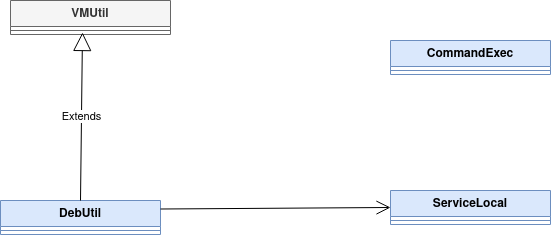
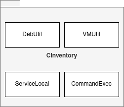
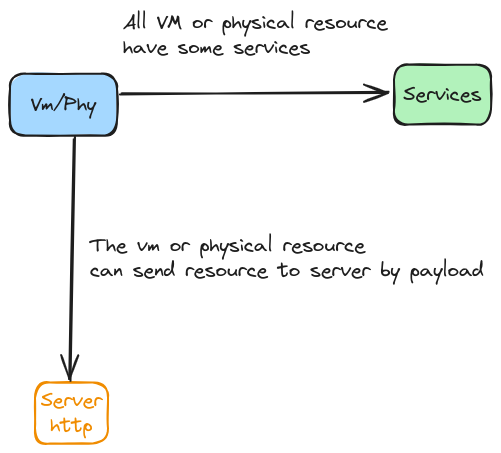
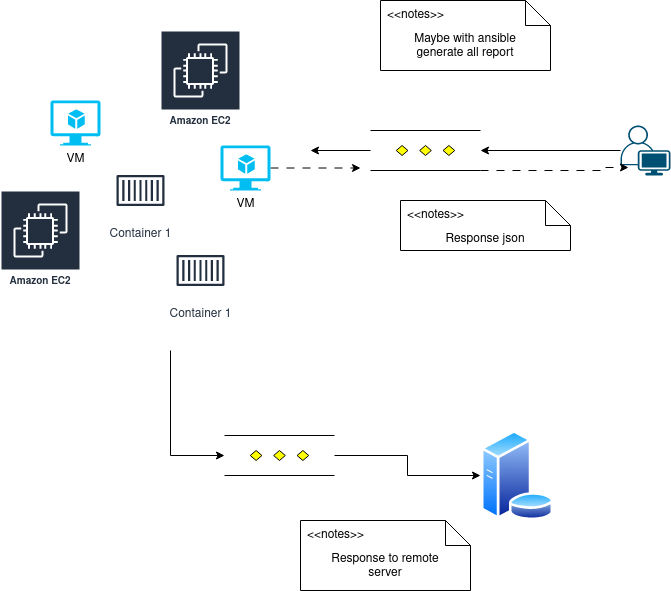
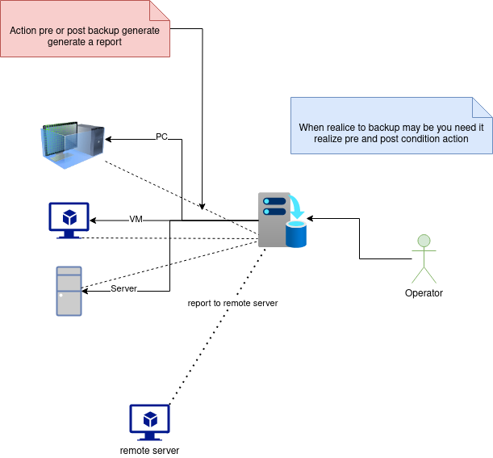

CInventory
=================================

CInventory is a application for build report:

- packages installed.
- os name.
- all ip direction on VM enable.
- total services on VM by configuration.
- send payload to server for procesing.

This project is licensed under the terms of the MIT license.

## Use case

IT operators need to know all or some digital resource to operate for day to day however for this particular task you need install some o different packages for generate inventory and maybe it complicates or difficult for differents restriction about the operative system or service container then it's simple solution for generate to report and send to remote server if you need it. 
This is Python application without need it root privileges.














## Configuration

The config file **/etc/cinventory/resource**

Optional parameter

- dependency: name string format seperate by ","
- folders: full path app configuration relavant separate by " "(blank space)

```
[DEFAULT]
id = some identify
name = name service applications

[virtual_resources]
name = service web applications
dependency = php, apache

[php]
name = php
folders = /etc/php
dependency = apache

[apache]
name = apache
folders = /etc/apache2

```

## ¿How to use?

Some situation need it collect custom data about service on VM,PC,etc. For example when you need collect it:

- ip 
- packages installed
- name resource
- dependency about installed
- ...

In this particular oportunity you don't need acoplate to server for work. This application is independent the server funcionality then you building a custom server and if you wish build particular rule for your services.

```

python -m cinventory_pyrdo.cli -h

```